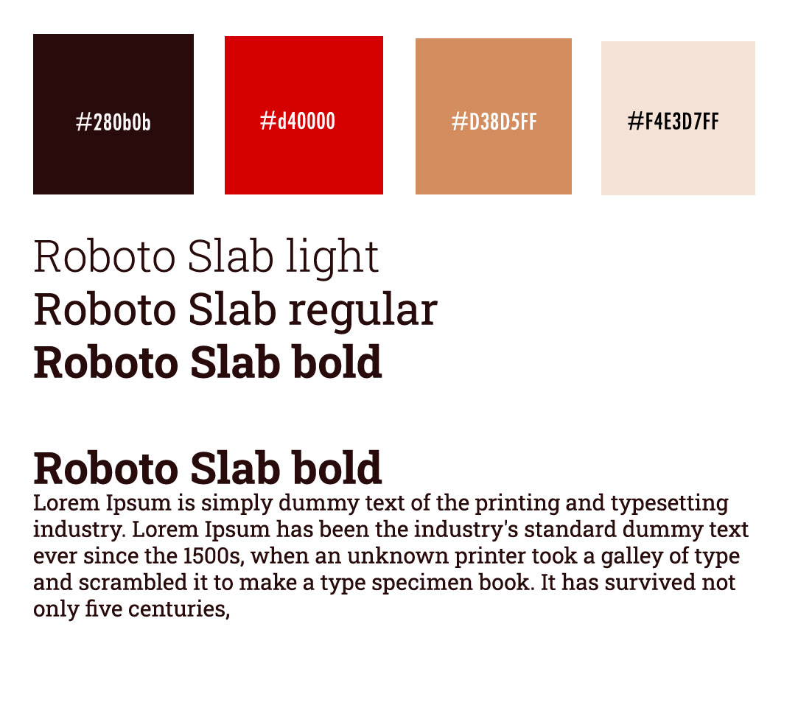

# Undirbúningur

1. [Búið til skipurit](Sitemap.md)
1. [Búið til leiðakerfi](wireframe/README.md)
1. [Ákveðið letur- og litasamsetningu](style-tyle/README.md)

Þegar byrjað er á að hanna vef þarf að skipuleggja innihald vefsins og hvernig samkskipti við notendur eiga að fara fram.

1. Forsíða (löndunarsíða (_Landing page_)
2. Dagskrá eða vörulýsing (_Features_)
4. Samskipti (_Contact_)
   * nýskráning 
   * innskráning 
   * viðskipti (_Buy - Order_)
5. Almennar upplýsingar (_About Us_)

<hr>

## Leiðakerfi (_Site map_)

Dæmi um einfalt skipurit

```
  Forsíða (index) - stutt lýsing á hvað á að vera á forsíðunni
  |_ Um okkur - stutt lýsing á hvað á að vera á síðunni (eða undirkafla)
  |_ Dagskrá eða Vöru- þjónustulýsing í stuttu máli
     |_ Undirsíða eða pop up gluggi, ef það hentar
  |_ Pöntunarsíða - stutt lýsing á hvernig samskiptin eiga að vera
  |_ Annað sem á að vera í vefnum - stutt lýsing
  
```

<hr>

## Tengirammi (_Wireframe_)

Næsta skref er að teikna upp skipulag á blaði sem sýnir aðeins staðsetningu efnis í mismunandi skjástærðum. Texti og myndir eru skilgreind sem línur og box. Tengingar (_links_) eru sýndar í öðrum lit.


## Stílbragð (_Style tyle_)

Við byrjum á að ákveða hvaða grunnlitir, tákn og leturgerðir eru notaðir í vefnum. Photoshop eða photopea henta vel til að sýna stílbragðið.

 

* [Litahringurinn](https://color.adobe.com/create/color-wheel/)
  * [Color Contrast Analyzer](https://color.adobe.com/create/color-contrast-analyzer)

[Frumgerð - _prototype_](prototype)

## Bjargir

#### Undirbúningur

* [Undirbúningur í 7 þáttum](https://webflow.com/blog/the-web-design-process-in-7-simple-steps)
* [Vefhönnun í 3 þáttum](https://webflow.com/blog/3-tools-to-power-your-design-review-process)
* [Leiðarkerfi (Wireframe)](https://www.freecodecamp.org/news/what-is-a-wireframe-ux-design-tutorial-website/)

#### Skipulag og frumhönnun

* [Gloomap skipurit](https://www.gloomaps.com/)
* [Flæðirit - Diagram](https://www.drawio.com/)

#### Frumhönnunartól (_Prototype tool_)

* Inkscape
  * [UI Design in Inkscape](https://manjitkarve.com/posts/inkscape-design-1/)
    * [Inkscape custom palette](https://manjitkarve.com/posts/inkscape-custom-palette/)
  * [Inkscape Custom Palette (YouTube video)](https://www.youtube.com/watch?v=Y1E8YWOB_Yc)
  * [Creating interactive wireframes with Inkscape and JavaScript](https://eclipsesource.com/blogs/2012/07/03/wireframing-inkscape-javascript/)
  * [How to add round corners (_border-radius_)](https://thepixelproducer.com/how-to-add-curves-or-round-corners-in-inkscape/)
  * [Inkscape leiðbeiningar](https://thepixelproducer.com/category/inkscape/)
* [Frumhönnun vefs](https://www.freecodecamp.org/news/designing-a-website-ui-with-prototyping/)
* [Free Prototyping tools](https://theproductmanager.com/tools/best-free-prototyping-tools/)

#### Notendaupplifun

* [7 Interactive Elements That Will Help You Get Users Attention](https://bamboolab.eu/blog/development/7-interactive-elements-that-will-help-you-get-users-attention)
* [How to Create a Landing Page That Will Sell Your Software Product](https://bamboolab.eu/blog/development/how-to-create-a-landing-page-that-will-sell-your-software-product)
* [UX Checklist](https://uxchecklist.github.io/)
* [52 weeks of UX](http://52weeksofux.com/post/475093254/10-principles-of-ux) 
